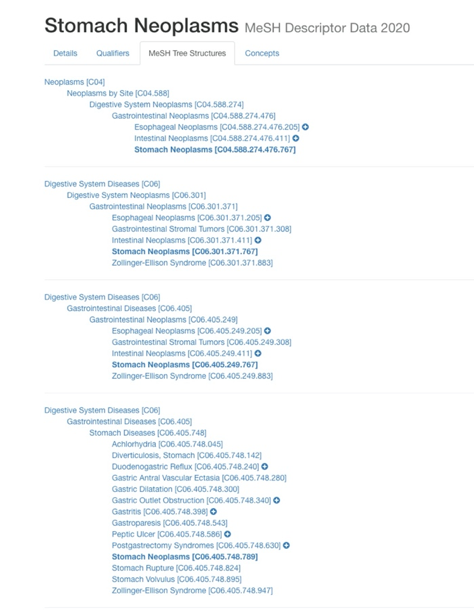

  

# CircRNA-DiseaseAnalysis

原论文：《An Efficient Approach based on Multi-sources Information to Predict CircRNA-disease Associations Using Deep Convolutional Neural Network》（paper文件夹中也有）

公式显示有问题的，可以下载下来用markdown阅读器看或者下载chrome的MathJax Plugin for Github插件。

### 1. 目的

​		基于假设：如果一个circRNA与一个disease相关联，那么功能接近的circRNA也可能与该disease相关联，表型接近（phenotypically similar）的disease也可能与该circRNA相关联。论文提出通过分析circRNA之间的相似度、disease之间的相似度，进而利用CNN提取相似度的特征，并利用Extreme Learning Machine（ELM）进行分类，判断circRNA与disease之间有没有联系。

### 2. 数据集

​		模型分析的数据主要来自两个数据集，一个是CIRCR2Disease（[点击访问](http://bioinfo.snnu.edu.cn/CircR2Disease/)），一个是MeSH数据集（[点击访问](https://www.nlm.nih.gov/)），CIRCR2Disease从661个circRNA、100种disease中分析出739种circRNA与disease之间的关系，而MeSH则提供了一个对disease之间的关系的专业分类。

​		这里主要介绍MeSH数据集，模型用到的数据主要是meshtrees这个数据，可在网站下载（[点击访问](https://www.nlm.nih.gov/databases/download/mesh.html)），数据包含两列，第一列是disease名，第二列是唯一ID。

​		Disease名在meshtrees中可以是重复的，但是ID是唯一的，ID反映了Disease之间的关系，比如Stomach Neoplasms的ID有四个，其中一个是C06.301.371.767，从这个ID我们可以知道Stomach Neoplasms属于Gastrointestinal Neoplasms（C06.301.371），而Gastrointestinal Neoplasms则属于Digestive System Neoplasms（C06.301），Digestive System Neoplasms属于Digestive System Disease（C06）。

​		整个MeSH数据集就像一个目录，指明了不同疾病之间的从属关系，而因为disease名是可以重复的，所以整个MeSH数据之间就相互连接起来。

### 3. 模型

​		为了计算出circRNA之间的相似度以及disease之间的相似度，论文主要提出三种模型，从CIRCR2Disease数据中的关联circRNA-disease进一步推导出其他可能的circRNA-disease。

#### 3.1 Disease Semantic Similarity Model 1

​		从对MeSH的介绍可以看出，如果两个disease属于同一个疾病的分支，那么他们就应该拥有更高的相似度，所以Model 1 从这里出发，定义了：

$DAG_d = (d, N_d, E_d)$

​		实际上，就是把一个disease所有上游的疾病都找出来，并构成一个属于他的集合，比如Stomach Neoplasms，就把它的四个分支的所有上游疾病找出来放在一起。

​		然后计算这个集合里面每个病对于Stomach Neoplasms的contribution：

$ D_d(e) = 1, \quad if\  e=d$

$D_d(e) = max\{\epsilon * D_d(e') \ | \ e' \in children \ \ of \  \ e \}, \quad if \ e \neq d$

​		式子的意思就是先设定一个epsilon，比如0.8，对Stomach Neoplasms本身设定contribution为1，对每一个上级迭代乘0.8，比如Gastrointestinal Neoplasms对Stomach Neoplasms的contribution为0.8，Digestive System Neoplasms对Stomach Neoplasms的contribution为0.64等等。

​		计算contribution的主要目的是为了计算不同disease之间的相似度：

$DV(d) = \sum_{e\in N_d} D_d(e)$

$SV_1(d(i),d(j)) = \frac{\sum_{e\in N_d(i) \bigcap N_d(j)}(D_{d(i)}(e)+D_{d(j)}(e))}{DV(d(i))+DV(d(j))}$

​		简单来说就是利用两种disease都有的上游disease的contribution去计算两种疾病之间的相似度。

#### 3.2 Disease Semantic Similarity Model 2

​		Model 1 有一个缺点，就是没有考虑到对于部分含有的上游疾病，应该给予他们更大的contribution。所以model 2就是基于这个不足提出的。

​		Model 2 的主要变化在于contribution的计算：

$D'_d(e) = -log(\frac{num(DAG_s(e))}{num(disease)})$

​		以上提出的model1和model2可以帮助我们计算MeSH中的disease之间的相似度，但是因为有部分疾病是CIRCR2Disease特有的，所以需要第三种模型去计算disease之间的相似度。

#### 3.3 Gaussian Interaction Profile Kernel Similarity

​		Gaussian Interaction Profile Kernel Similarity不仅可以帮助我们计算disease之间的相似度，还可以计算circRNA之间的相似度。

​		CIRCR2Disease数据集分析了661种circRNA和100种disease，首先我们构建一个661*100的矩阵，元素全部填充为0，然后对于CIRCR2Disease分析出有关联的circRNA-disease，把矩阵中对应的元素改为1，这样得到的矩阵，每行表示某个circRNA和100种disease的关系，每列表示某个disease和661种circRNA的关系。

​		我们可以使用矩阵的列向量表示每个disease，使用矩阵的行向量表示每个circRNA，得到了disease和circRNA的向量表示之后，就可以利用下式计算相似度：

$GR(c(i), c(j)) = exp(-\theta_c||V(c(i))-V(c(j))||^2) $

$\theta_c = \frac{1}{n}\sum^n_{i=1} ||V(c(i))||^2$

​		实际计算后发现，由于661种circRNA和100种disease中只有很少一部分有关联，所以计算得到的矩阵十分稀疏，最后得到的相似度普遍过于接近，作用不大。

#### 3.4 Multi-source Data Fusion

​		之前计算了disease之间的相似度以及circRNA之间的相似度，其实只用Gaussian Interaction Profile Kernel Similarity对CIRCR2Disease数据集进行分析也足够计算CIRCR2Disease中的disease之间的相似度，但是实际上计算得到的相似度不理想，所以才需要借助MeSH数据集精确分析disease之间的相似度。

​		所以最后我们需要融合这几种相似度计算，第一个步骤是结合model 1和model 2，只需要求均值即可，第二步是找出CIRCR2Disease中能在MeSH找到的disease，用MeSH的相似度更新原来计算的相似度，比如对于CIRCR2Disease中的Trachoma和Ehrlichiosis，这一对disease也存在于MeSH，计算得到的相似度为0.5，就用0.5替换原来用Gaussian Interaction Profile Kernel Similarity计得的0.4。

​		但是因为命名格式的不统一，实际计算过程中会发现，很难找到同时出现在CIRCR2Disease和MeSH的disease对。

#### 3.5 CNN与ELM

​		我们得到了CIRCR2Disease数据集中disease之间的相似度以及circRNA之间的相似度，然后就可以利用CNN进行特征提取，模型的输入由circRNA和disease的两个相似度向量拼接而成，因为一共有661种circRNA、100种disease，所以模型的每个输入的尺寸为1*761，而最终ELM的输出则可以为单纯的二分类，判断是否有联系。

### 4. 代码简单说明

​		data中已经包含了模型分析需要的数据，首先可通过similarity1和similarity2计算相似度，依次利用association_matrix、gaussianSimilarity计算第三种相似度，最后运行descriptor融合这三种相似度。

​		需要注意的是，原始数据只包含有关联的circRNA-disease对，所以我们要随机添加circRNA-disease对作为没关联的数据，这个过程我是用excel做的，详情可看论文，然后再运行buildTrainset，主要是用计算的相似度向量替换数据中的disease和circrna字符串，这样我们就完成了数据的预处理。

​		最终的模型我只是简单写了一个神经网络做二分类，这部分可以任由大家自由发挥，可以跟着论文用CNN和ELM分析，也可以用其他模型，因为整个模型最关键还是前面的数据处理部分，所以这里关于深度学习模型的应用就不过于深究了。